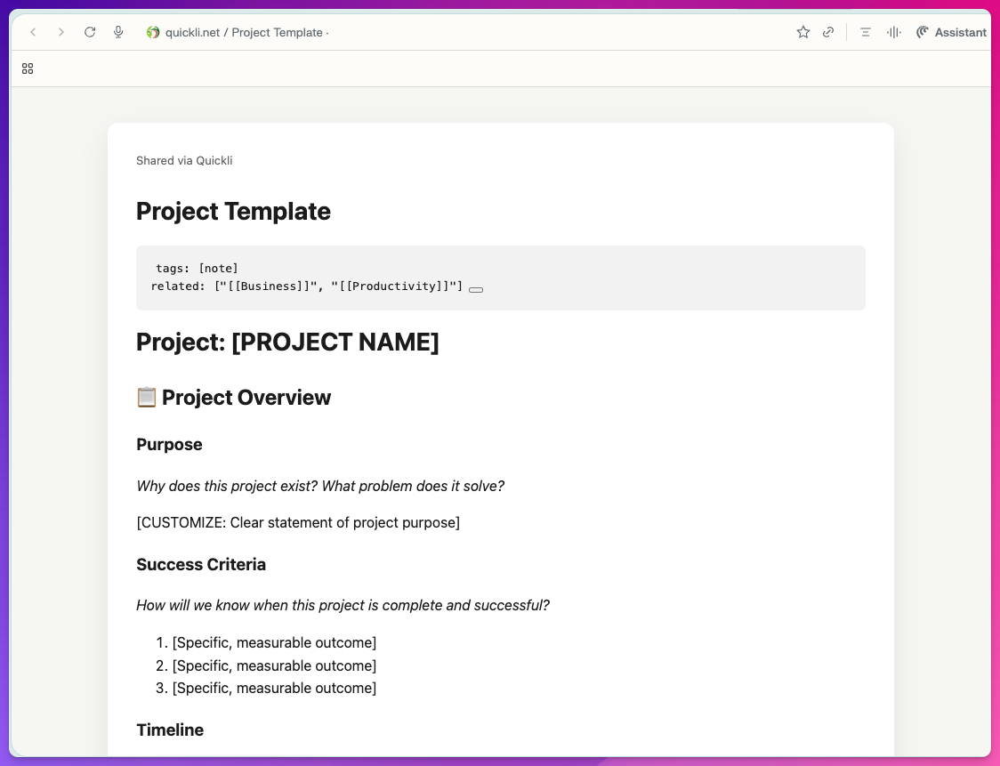
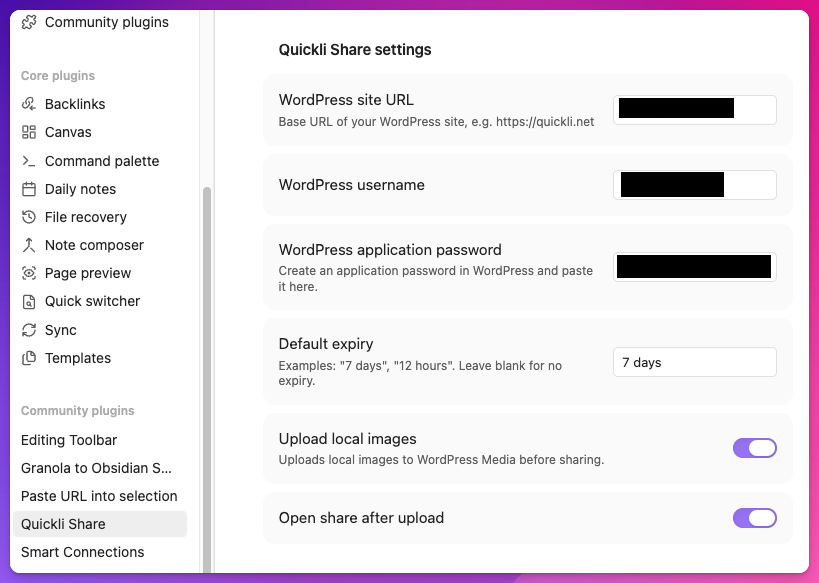
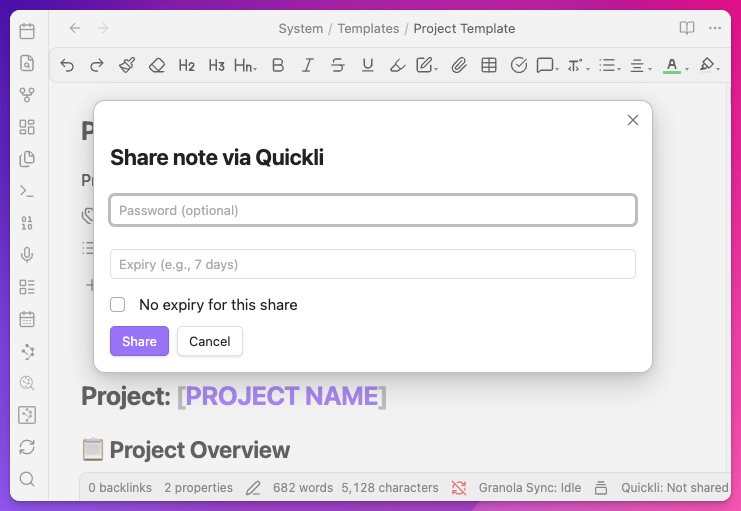

# Quickli Share

Share Obsidian notes as unlisted WordPress pages in seconds.

Quickli consists of two parts working together:

1. **Obsidian plugin** (`obsidian-plugin/`) to publish notes, update shares, set passwords, and revoke links.
2. **WordPress plugin** (`wordpress-plugin/`) to store/render shares and serve unlisted URLs.

---

## What Quickli can do

- Share any Obsidian note via a unique unlisted URL (`/q/<token>/`)
- Optional password protection per share
- Optional expiry (`7 days`, `12 hours`, etc.)
- Update existing shares instead of creating duplicates
- Revoke shares from Obsidian
- Copy/open/email share links from the Obsidian modal
- Optional upload of local images to WordPress Media before publish
- Share complete standalone HTML documents via the same unlisted `/q/<token>/` URL flow
- `vault` redirect pages (`/vault/<vault>/<path>`) that launch `obsidian://open?...`

---

## Screenshots

> The screenshots below are sanitized (sensitive values are redacted).

### Obsidian settings



### Share modal in Obsidian



### Shared note page



---

## Repository structure

```text
quickli/
├─ obsidian-plugin/
│  ├─ main.ts
│  ├─ main.js
│  ├─ manifest.json
│  ├─ styles.css
│  └─ package.json
├─ wordpress-plugin/
│  └─ quickli-share.php
└─ docs/
   └─ screenshots/
```

---

## How it works (high level)

1. In Obsidian, the plugin reads the current note.
2. Markdown is rendered to HTML.
3. Optional: local images are uploaded to `wp-json/wp/v2/media` and links are replaced.
4. Obsidian calls `POST /wp-json/quickli-share/v1/share` with Basic Auth (WordPress application password).
5. WordPress stores the share as a private custom post type (`quickli_share`) with metadata (token, expiry, source path).
6. The public unlisted URL is returned and shown in Obsidian.

---

## Installation

### 1) WordPress plugin

Install `wordpress-plugin/quickli-share.php` as a standard WordPress plugin and activate it.

After activation, Quickli provides:

- REST endpoints under `quickli-share/v1`
- Unlisted share route: `/q/<token>/`
- Vault redirect route: `/vault/<vault>/<path>`

### 2) Obsidian plugin

Build/copy the plugin in your Obsidian vault plugin directory:

```bash
cd obsidian-plugin
npm install
npm run build
```

Then enable **Quickli Share** inside Obsidian Community Plugins.

---

## Obsidian configuration

Set these values in the plugin settings:

- **WordPress site URL** (e.g. `https://quickli.net`)
- **WordPress username**
- **WordPress application password**
- **Default expiry** (optional)
- **Upload local images** (optional)
- **Open share after upload** (optional)

---

## Obsidian commands

- `Share note`
- `Copy share URL`
- `Set or clear share password`
- `Revoke share`

A status bar item shows whether the current note is shared and if it is password-protected.

---

## WordPress REST API (used by the Obsidian plugin)

Base path:

```text
/wp-json/quickli-share/v1
```

Endpoints:

- `POST /share` → create or update a share
- `GET /share/{id}` → fetch share metadata
- `DELETE /share/{id}` → revoke share

To share a full HTML document, send:

```json
{
  "title": "Meeting document",
  "share_type": "html_document",
  "content_html": "<!doctype html>..."
}
```

HTML document shares are served as-is, without the Quickli wrapper, while keeping the same unlisted token URL, password support, expiry support, and noindex headers. Use this only for trusted HTML generated by you.

Local standalone HTML files can be uploaded with:

```bash
QUICKLI_USERNAME=... QUICKLI_APP_PASSWORD=... \
node scripts/share-html.mjs /path/to/document.html "Meeting document"
```

The script stores the returned `share_id` in `.quickli-shares.json` next to the HTML file. Running the same command again updates the existing share and keeps the public URL stable. Use `QUICKLI_SHARE_ID=...` or `QUICKLI_STATE_FILE=...` when you need to override that mapping.

Auth/permissions:

- Uses WordPress authentication (Application Passwords)
- Permission callback requires capability: `edit_posts`

---

## Security and privacy notes

- Share links are **unlisted**, not indexed pages.
- Tokenized URLs are generated with cryptographically secure randomness (`random_bytes`).
- Share pages send noindex headers (`X-Robots-Tag: noindex, nofollow, noarchive`).
- Password protection is supported per share.
- Expiry can auto-delete old shares via daily cleanup cron.

### Public repo hygiene

Before publishing this repository:

- Do **not** commit real credentials, app passwords, or private base URLs.
- Keep screenshots redacted (as in `docs/screenshots/`).
- Avoid committing local artifacts (`.DS_Store`, local logs, exports).

---

## Version snapshot

Current versions in this repo:

- WordPress plugin header: `0.3.0`
- Obsidian manifest: `0.1.0`

---

## License

No license file is currently included in this repository.
Add a `LICENSE` file before wider public distribution.
